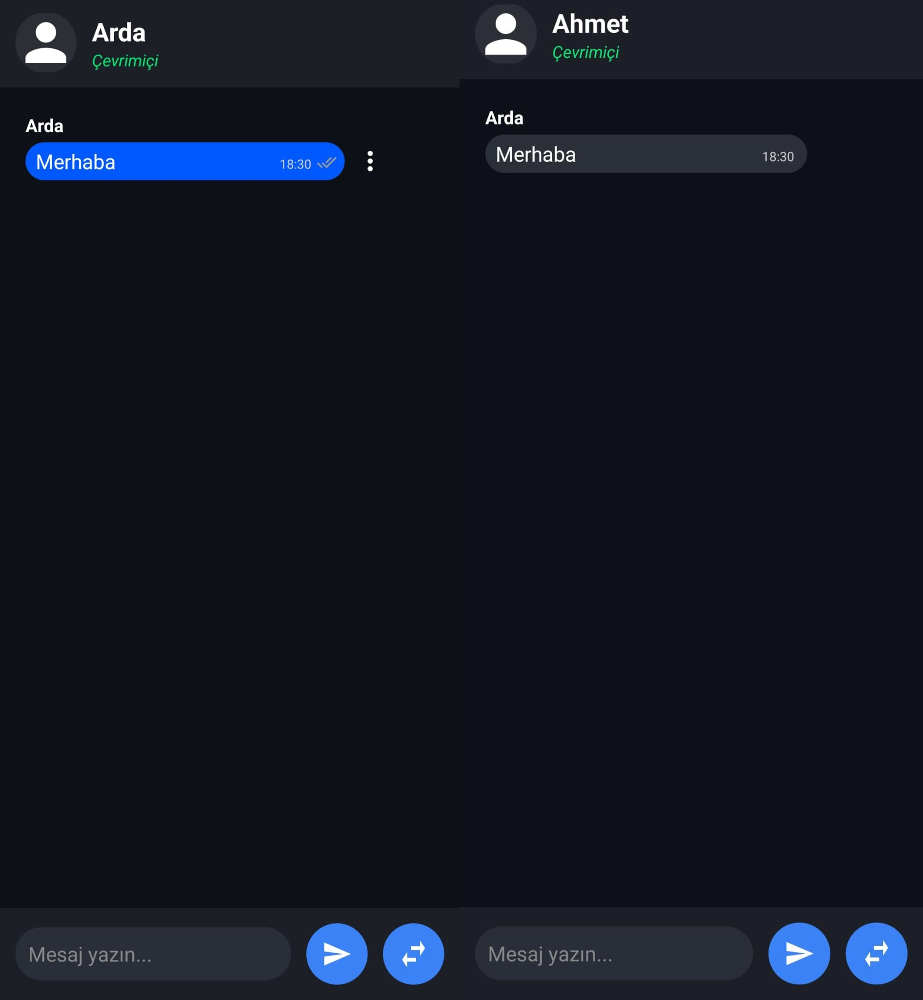
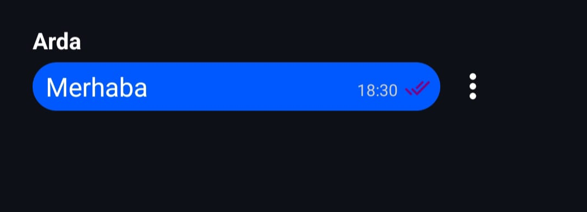
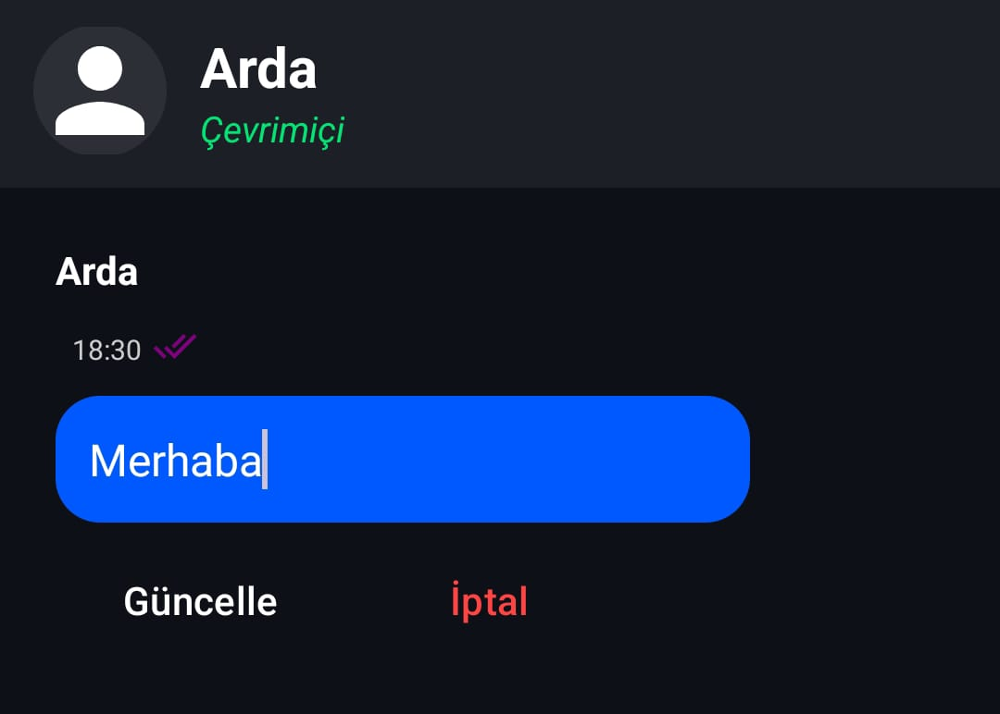
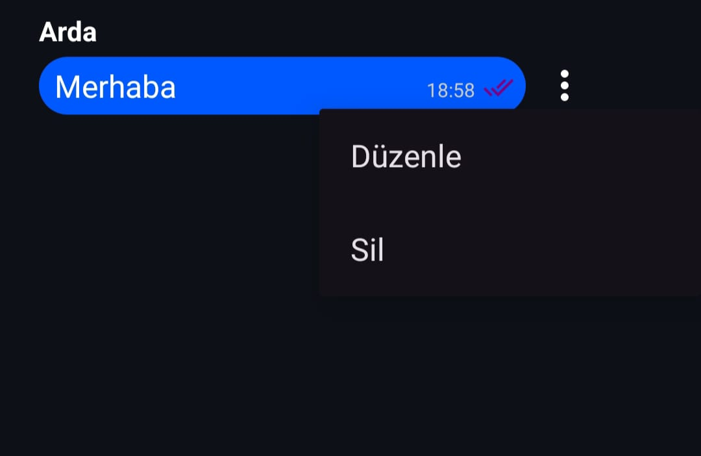

# 📱 Sohbet Uygulamam - Arda & Ahmet

Kullanıcı geçişi yapılabilen, Arda ve Ahmet arasında mesajlaşmayı gösteren Android sohbet uygulaması yaptım.

---

##  1. Mesajlaşma Ekranı (Arda ve Ahmet)

Uygulamada, Arda ve Ahmet kullanıcıları arasında geçen mesajlaşmalar gösterilmektedir.
Mesajlar kullanıcıya göre farklı renkte gösterilir ve kullanıcılar arasında geçiş yapılabilir.
---

##  2. Okundu Bilgisi

Gönderilen mesajın karşı taraf tarafından görülüp görülmediği bu ekranda gösterilir.  
Mesaj okunduğunda sağ alt köşedeki tik işareti **mor** renge dönüşür.

---

##  3. Mesaj Güncelleme

Kullanıcı, sohbet ekranında mesajın sağ tarafında bulunan üç noktaya tıklayarak düzenle seçeneğini kullanabilir.
Bu işlemle, gönderdiği mesajın içeriğini güncelleyebilir.

---

##  4. Mesaj Silme

Kullanıcı, sohbet ekranında mesajın sağ tarafında bulunan üç noktaya tıklayarak sil seçeneğini kullanabilir.
Bu işlemle, seçilen mesaj silinir 
---
